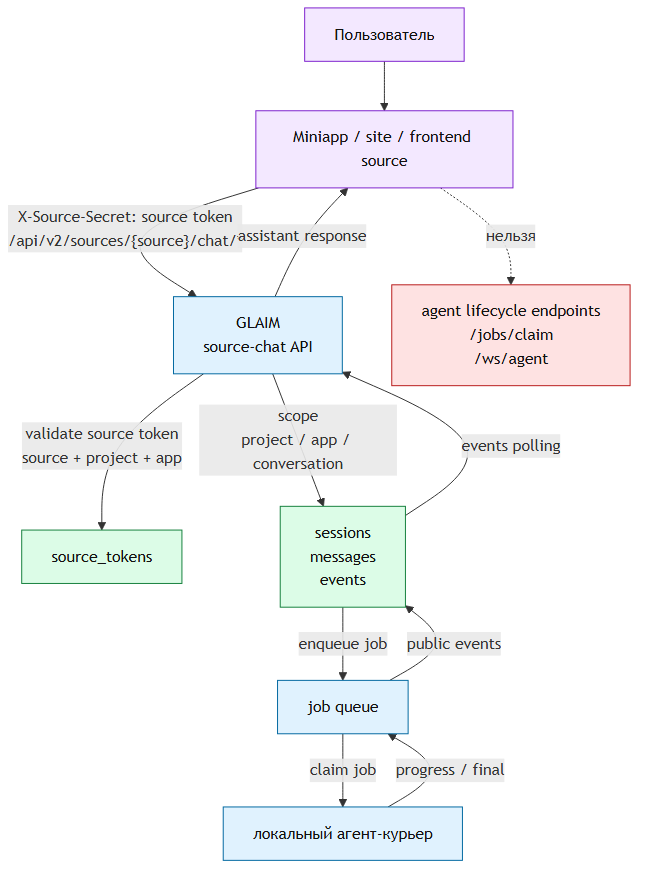
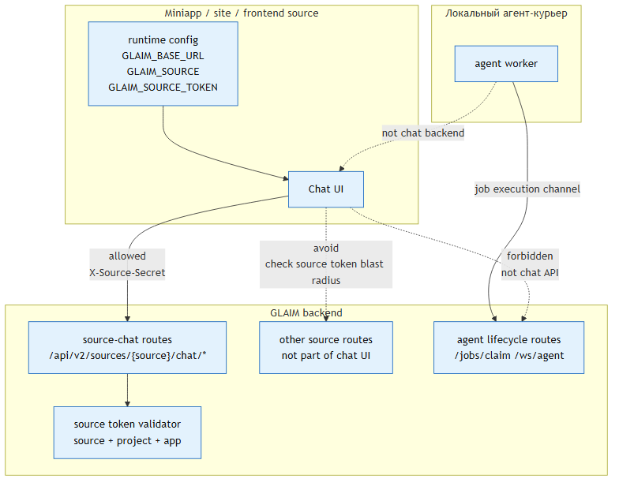
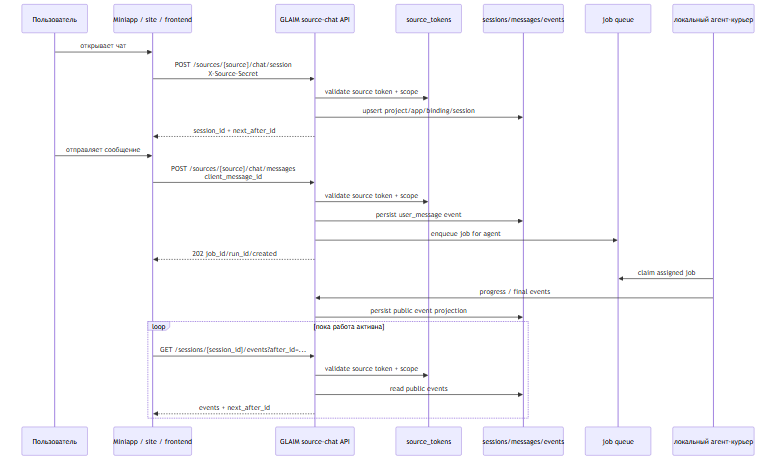
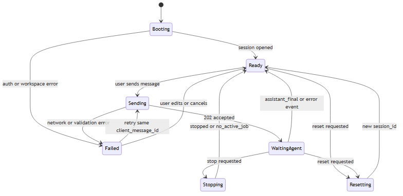

# GLAIM chat frontend diagrams

Этот файл нужен, чтобы агент видел не только Mermaid-исходники, но и готовые
графические рендеры схем.

## 1. Canonical chat flow

Miniapp/сайт/frontend ходит напрямую в GLAIM source-chat API через source token.
Gigma backend/BFF в канонической цепочке нет; локальный агент — исполнитель job,
а не backend чата.

Файлы: `chat-frontend-flow.mmd`, `chat-frontend-flow.svg`, `chat-frontend-flow.png`.

## 2. Auth boundaries

Показывает source-token-only модель для frontend: `X-Source-Secret` идёт только
в source-chat routes, а agent lifecycle routes не являются частью chat UI.

Файлы: `chat-auth-boundaries.mmd`, `chat-auth-boundaries.svg`, `chat-auth-boundaries.png`.

## 3. Runtime sequence

Показывает runtime-цепочку: открыть session, отправить message, поставить job в
queue, получить события от локального агента и вернуть их frontend через polling
или websocket.

Файлы: `chat-runtime-sequence.mmd`, `chat-runtime-sequence.svg`, `chat-runtime-sequence.png`.

## 4. UI state machine

Минимальная модель состояния ChatGPT-like интерфейса: booting, ready, sending,
waiting_agent, stop/reset и retry.

Файлы: `chat-ui-state-machine.mmd`, `chat-ui-state-machine.svg`, `chat-ui-state-machine.png`.
