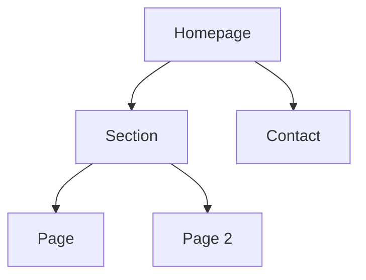

# Information architecture output

## Executive summary

[Что строим, для кого, зачем, главный принцип структуры.]

## Sitemap: ASCII

```text
Homepage (/)
├── Section (/section)
│   ├── Page (/section/page)
│   └── Page (/section/page-2)
└── Contact (/contact)
```

## Sitemap: Mermaid



## URL map

| Page | URL | Parent | Template | Nav location | Priority | Search intent | CTA |
|---|---|---|---|---|---|---|---|
| Homepage | `/` | — | home | Header | High | brand/category | Book demo |

## Navigation spec

### Header

1. [Item]
2. [Item]
3. [CTA]

### Footer

- Product:
- Resources:
- Company:
- Legal:

### Breadcrumbs

- Pattern:
- Pages that need breadcrumbs:

## Taxonomy

- Content types:
- Categories:
- Tags:
- Metadata fields:
- Governance rules:

## Internal linking plan

| Source page | Target page | Anchor idea | Reason |
|---|---|---|---|
| | | | |

## Redirects, if redesign

| Old URL | New URL | Redirect type | Reason |
|---|---|---|---|
| | | 301 | |
