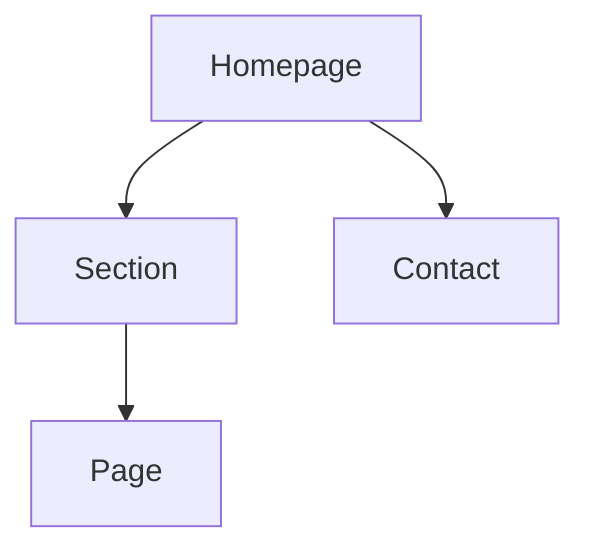

# Information architecture document template

```markdown
# Information architecture

## Executive summary

- Site type:
- Primary audience:
- Main user tasks:
- Business goals:
- IA principle:

## Audience mental models

| Audience/task | What they look for | How to label it | Priority |
|---|---|---|---|

## Page inventory

| Page | Type | Goal | Audience | Search intent | CTA | Status |
|---|---|---|---|---|---|---|

## Sitemap: ASCII

```text
Homepage (/)
├── [Section] (/section/)
│   ├── [Page] (/section/page/)
└── [Contact] (/contact/)
```

## Sitemap: Mermaid



## URL map

| Page | URL | Parent | Template | Nav location | Priority | Notes |
|---|---|---|---|---|---|---|

## Navigation specification

### Header

| Label | URL | Why here | Dropdown items |
|---|---|---|---|

### Footer

- Product/service:
- Resources:
- Company:
- Legal:

### Breadcrumbs

- Pattern:
- Applies to:

## Taxonomy and metadata

| Content type | Categories | Tags | Required fields | Governance |
|---|---|---|---|---|

## Labeling rules

- Use user language over internal names.
- Use nouns for destinations and verbs for actions.
- Avoid duplicate labels with different meanings.

## Internal linking plan

| Source | Target | Anchor idea | Reason |
|---|---|---|---|

## Redirect map, if redesign

| Old URL | New URL | Redirect | Reason |
|---|---|---|---|

## Implementation notes

- CMS collections:
- Templates:
- Filters:
- Canonical rules:
- Analytics events:
```
