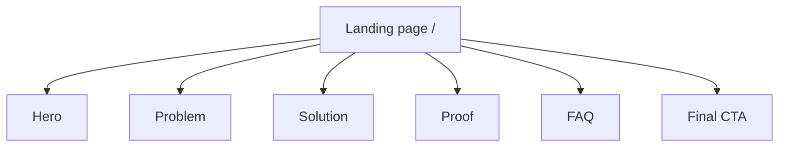
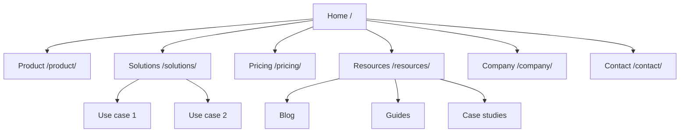
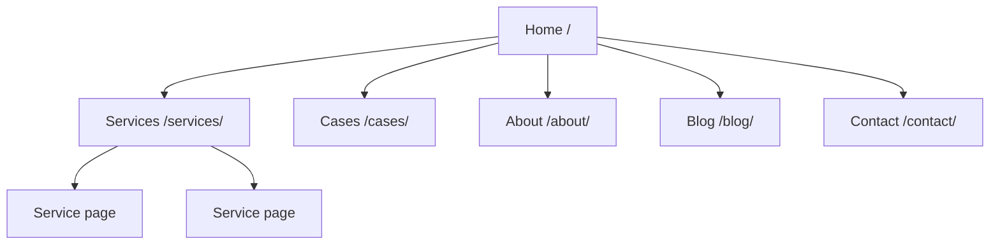
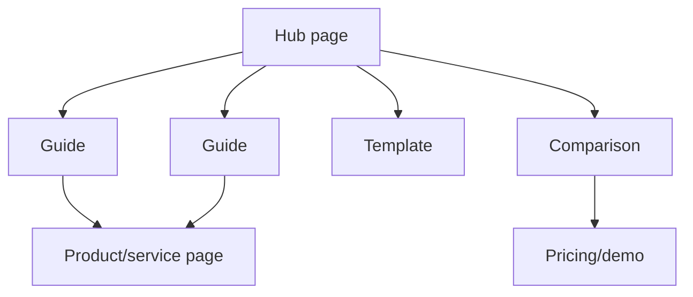

# Sitemap Mermaid templates

Use Mermaid when the user wants a visual sitemap that can be pasted into docs, GitHub, Notion-compatible tools, or design handoff.

## Simple landing page

## Multi-page marketing site

## Service business

## Content hub and spokes

## Notation rules

- Use readable node labels.
- Include URLs in labels for important pages.
- Keep the diagram high-level first; detailed page inventory belongs in a table.
- For large sites, create one diagram per section.
